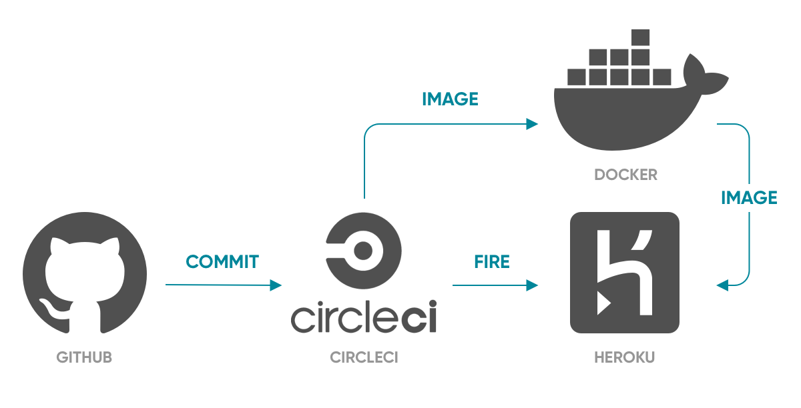
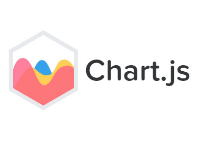

# News

This project is using the following CI/CD pipeline.
 

Inside angular, we're using @ngrx store for state management and chart.js for chart visualization
All the components are using onpush change detection strategy

